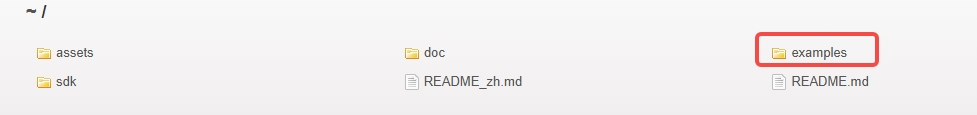
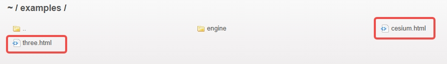

# LCC Web SDK

# 简要

LCC Web SDK是其域官方提供的LCC开发套件，支持在Web端加载lcc文件，并将数据渲染出场景，支持射线检测，点云切换，环境数据切换，细节渲染等诸多常用功能。支持主流浏览器：Chrome，Firefox，Safari，Edge。

# 如何下载

访问 [https://developer.xgrids.cn/#/download?page=LCC_WEB_SDK](https://developer.xgrids.cn/#/download?page=LCC_WEB_SDK) 可获取最新开发包，其中包括SDK和示例程序。

另外，examples代码中用到的测试数据可从 [样例数据](https://developer.xgrids.cn/#/download?page=sampledata) 下载，下载完成后放入 `your_sdk_path/assets` 目录下。

# 运行examples

在开始之前确保已经安装好了Node.js开发环境，确保 `样例数据` 已下载，并且路径和代码中 `dataPath` 一致。

确认没有问题后，打开一个终端，若是Windows可打开 Windows PowerShell， 若是Linux或MacOS系统打开相应平台的命令行终端即可。接下来按如下步骤运行命令。

**第一步**: 使用cd命令进入到sdk的根目录下
``` shell
cd your_sdk_path/
```

**第二步**: 安装 `live-server` 命令行工具
``` shell
npm i -g live-server
```

**第三步**: 启动 `live-server` 服务
``` shell
live-server --cors
```

**第四步**: 服务启动后会打开浏览器，在浏览器上选择需要运行的示例程序。例如，点击 three.html 项将运行threejs示例     




# 技术支持

开发者文档：https://developer.xgrids.cn/#/document?titleId=cn-1720170149933     
开发者论坛：https://developer.xgrids.cn/#/forum     
视频教程：https://developer.xgrids.cn/#/tutorial?page=web_sdk       


